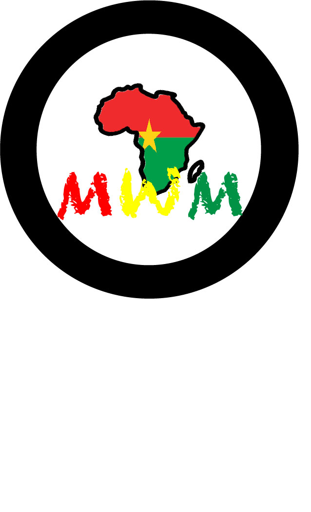

# julienilboudo.github.io
<!DOCTYPE html>
<html>
  
  <head>
  <title>Manna Wanna
  </title>
  </head>
  
 
 <body bgcolor+"#F47F65">
  
  <h1 style="font-family:times new roman">Manna Wanna Movement</h!>
  
Afrobeats To The World

    

    
    

    
    

    </body>
    </html>
    
    
    
    
 

